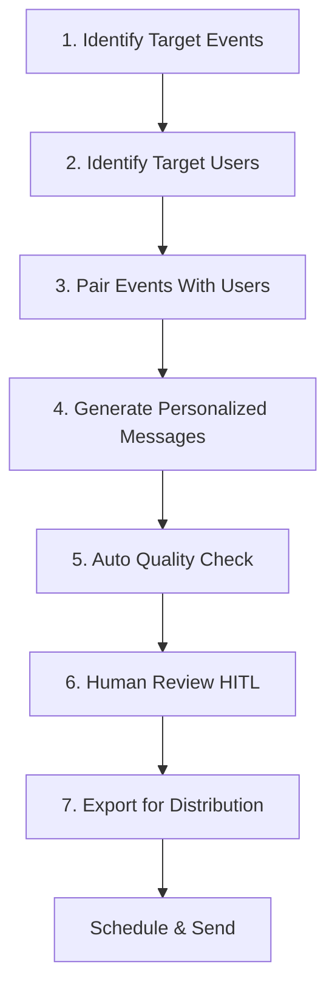

# Leo 🦁

> LLM-powered agent for personalized event outreach and user engagement on the Cuculi platform

[](https://opensource.org/licenses/MIT)
[](https://github.com/ChrisCruze/Leo)

## Overview

Leo is an intelligent LLM-powered agent designed to increase event attendance and deepen user engagement on the Cuculi platform. Through sophisticated event-user matching, personalized outreach generation, and human-in-the-loop quality control, Leo operates as a semi-autonomous engagement engine focused on reactivating dormant users while strengthening relationships with active participants.

### Core Mission

Operate as an automated engagement engine that:
- 🎯 **Targets the Right Users**: Identifies and prioritizes users based on interests, behavior, and engagement patterns
- ✉️ **Personalizes Outreach**: Generates contextually relevant messages tailored to individual user preferences
- 📈 **Drives Attendance**: Increases event turnout through strategic, timely communication
- 🔄 **Reactivates Dormant Users**: Re-engages inactive users with compelling, personalized invitations
- ⚖️ **Balances Automation & Oversight**: Maintains message quality through automated checks and human review

## Key Features

### 🤖 Intelligent Matching
- Event-user pairing based on topical alignment and past behavior
- Dormancy status tracking and targeted re-engagement
- Interest-based recommendations
- Time preference optimization

### ✍️ Personalized Messaging
- Context-aware message generation
- Tone calibration based on user activity level
- Behavior-based nudges and value propositions
- Multi-channel support (SMS, Email)

### 🎯 Quality Assurance
- Automated quality checks for accuracy, relevance, and tone
- Human-in-the-loop review workflow
- Iterative feedback integration
- Message approval tracking

### 📊 Performance Tracking
- Event attendance attribution
- Reactivation rate monitoring
- Message quality metrics
- Reviewer efficiency analysis

## How It Works

Leo follows a structured seven-step workflow:



### Workflow Details

1. **Identify Target Events**: Scan upcoming schedule, prioritize events needing attendance
2. **Identify Target Users**: Select users by theme, past behavior, and re-engagement potential
3. **Pair Events With Users**: Match via topical alignment and user preferences
4. **Generate Personalized Messages**: Draft tailored outreach considering user context
5. **Final Message Review**: Run automated checks for quality and accuracy
6. **Human-in-the-Loop Review**: Present drafts to human reviewers for validation
7. **Export for Distribution**: Format approved messages for SMS/email scheduler

## Success Metrics

### Core KPIs

| Metric | Description | Target |
|--------|-------------|--------|
| **Message Volume** | High-quality messages per week | TBD |
| **Message Quality** | Clarity, personalization, accuracy score | >85% |
| **Attendance Impact** | Event turnout increase | +20% |
| **Reactivation Rate** | Dormant users returning | >15% |
| **Reviewer Efficiency** | Reduction in manual edits | <10% edit rate |

## Messaging Guidelines

### Tone & Voice
- ✅ Friendly and warm
- ✅ Clear and actionable
- ✅ Respectful of user time
- ❌ Avoid sales-like language
- ❌ No heavy-handed urgency

### Quality Checklist
- [ ] Accurate event details
- [ ] Personal relevance to user
- [ ] Appropriate tone and clarity
- [ ] Clear actionable next step
- [ ] Brevity (SMS <160 chars)

### Message Scheduling

**Optimal Windows**:
- Morning: 7:30 AM - 10:00 AM
- Midday: 12:00 PM - 2:00 PM  
- Evening: 6:00 PM - 9:00 PM

**Avoid**:
- Before 7:30 AM
- After 10:00 PM

## Development Roadmap

### Phase 1: Foundation (Current)
- [x] Core workflow implementation
- [x] Operational blueprint
- [ ] Prompt refinement
- [ ] Automated quality checks
- [ ] HITL review interface

### Phase 2: Reliability
- [ ] End-to-end error handling
- [ ] Comprehensive logging
- [ ] Message formatting standardization
- [ ] Backend integration

### Phase 3: Scale
- [ ] Minimize reviewer edits (<10%)
- [ ] Multi-event type validation
- [ ] A/B testing framework
- [ ] Performance dashboards

### Phase 4: Autonomy
- [ ] Full integration with Cuculi engagement engine
- [ ] Multi-channel orchestration
- [ ] Predictive user modeling
- [ ] Self-optimizing campaigns

## Documentation

- [Operational Blueprint](./docs/OPERATIONAL_BLUEPRINT.md) - Complete technical specification
- [Messaging Guidelines](./docs/MESSAGING_GUIDELINES.md) - Quality standards and best practices
- [Architecture](./docs/ARCHITECTURE.md) - System design and components
- [API Reference](./docs/API.md) - Integration endpoints and schemas

## Getting Started

```bash
# Clone the repository
git clone https://github.com/ChrisCruze/Leo.git
cd Leo

# Install dependencies
npm install

# Configure environment
cp .env.example .env
# Edit .env with your credentials

# Run Leo
npm start
```

## Configuration

Key environment variables:

```bash
# LLM Configuration
LLM_PROVIDER=openai
LLM_MODEL=gpt-4
LLM_API_KEY=your_api_key

# Cuculi Platform
CUCULI_API_URL=https://api.cuculi.com
CUCULI_API_KEY=your_cuculi_key

# Messaging
SMS_PROVIDER=twilio
EMAIL_PROVIDER=sendgrid
```

## Contributing

We welcome contributions! Please see our [Contributing Guidelines](./CONTRIBUTING.md) for details.

1. Fork the repository
2. Create a feature branch (`git checkout -b feature/amazing-feature`)
3. Commit your changes (`git commit -m 'Add amazing feature'`)
4. Push to the branch (`git push origin feature/amazing-feature`)
5. Open a Pull Request

## Tech Stack

- **LLM**: OpenAI GPT-4, Anthropic Claude
- **Backend**: Node.js, Express
- **Database**: MongoDB
- **Messaging**: Twilio (SMS), SendGrid (Email)
- **Monitoring**: Datadog, Sentry

## License

This project is licensed under the MIT License - see the [LICENSE](./LICENSE) file for details.

## Team

Built with ❤️ by the Cuculi team

- **Product Lead**: [Chris Cruze](https://github.com/ChrisCruze)

## Acknowledgments

- Inspired by modern LLM agent architectures
- Built for the Cuculi social dining community
- Powered by cutting-edge AI technology

## Contact

For questions or feedback:
- 📧 Email: support@cuculi.com
- 🐦 Twitter: [@cuculi](https://twitter.com/cuculi)
- 💬 Discord: [Join our community](https://discord.gg/cuculi)

---

**Status**: Active Development | **Version**: 0.1.0 | **Last Updated**: November 2025
